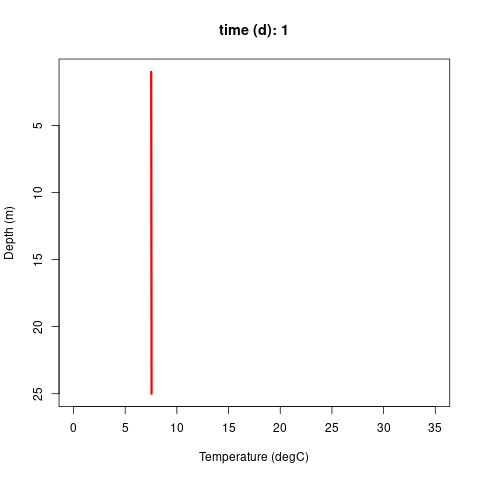
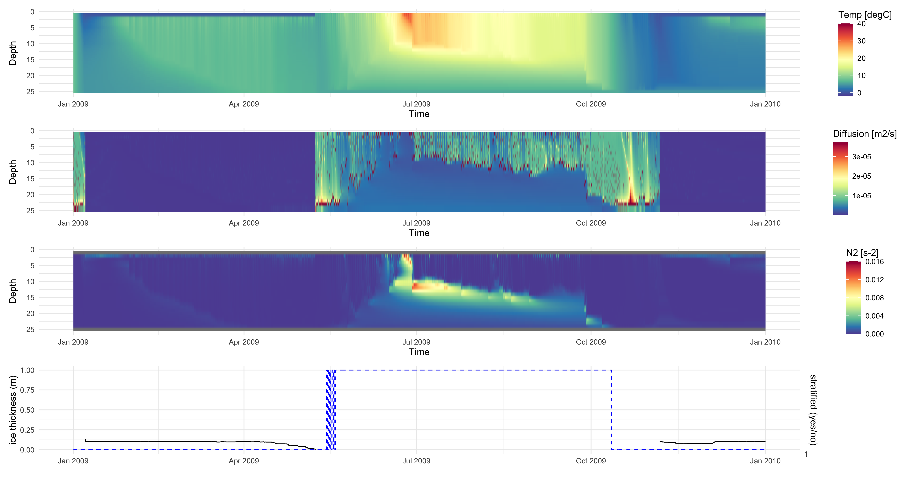

# Lake Modeling Scripts for R and Python

Collection of scripts to simulate heat transport as well as reactive transport in aquatic ecosystems.
- 1D_HeatDiffusion: Python code for 1D heat diffusion
- 1D_HeatMixing: R code to run a thermodynamic lake model: (i) calculates vertical eddy diffusivities for vertical exchange, (ii) simulates vertical diffusion using a central difference scheme and heat exchange between atmosphere and surface water layer, (iii) estimates mixing depth at which (internal) potential energy is higher than (external) kinetic energy by wind and mix water column up to that depth, (iv) solves vertical density instabilities by averaging, and (v) checks for ice formation and ice growth.
- 1D_HeatMixing_macrophytes: R code to run a thermodynamic lake model similar to 1D_HeatMixing but with code to replicate energy attenuation by submersed macrophyte growth
- 1D_HeatMixing_DO: R code to run a thermodynamic lake model similar to 1D_HeatMixing but with additional code to simulate dissolved oxygen dynamics (exchange with atmopshere, constant volume sink, and dynamic areal sink)
- 1D_HeatMixing_IBM: R code to run a thermodynamic lake model similar to 1D_HeatMixing but with code to simulate phytoplankton species through an individual-based modeling framework
- 1D_HeatMixing_PGDL: R and Python code to run a thermodynamic lake model similar to 1D_HeatMixing but with code to estimate parameters through deep learning

Click [here](https://github.com/robertladwig/LakeModeling/blob/main/Manual/1D_IntegralEnergy.pdf) for an overview of the model algorithm. 

## To do 
- ~~add BC to 1D heat transport, i.e., meteorological driver data~~
- ~~add macrophyte model~~
- ~~add ice module~~
- ~~check numerical stabilities~~
- more advanced turbulence closure scheme for 1D heat transport
- coupling to reactive biogeochemical processes
  - dissolved oxygen
  - nutrient
  - light
  - phytoplankton biomass
- experimental: microscale closure scheme
- (ON-GOING!) experimental: individual-based modeling of phytoplankton
- 2D advective-diffusive heat transport

<!-- -->
